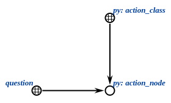

# py-sc-kpm

The python implementation of the knowledge processing machine (kpm)
for [sc-machine](https://github.com/ostis-ai/sc-machine).
Library provides tools for interacting with knowledge bases.
Communication with server is implemented in separate library
named [py-sc-client](https://github.com/ostis-ai/py-sc-client).
This module is compatible with 0.7.0 version
of [OSTIS Technology platform](https://github.com/ostis-ai/ostis-web-platform).

# API Reference

## Classes

The library contains the python implementation of useful classes and functions to work with the sc-memory.

There is a list of classes:

- ScKeynodes
- ScAgent
- ScModule
- ScServer

### ScKeynodes

A singleton dict-like object which provides
the ability to cache the identifier and ScAddr of keynodes stored in the KB.

```python
from sc_kpm import sc_types, ScKeynodes

keynodes = ScKeynodes()  # Create an instance of the ScKeynodes class to get access to the cache

# Get the provided identifier
keynodes["identifier_of_keynode"]  # Returns an ScAddr of the given identifier

# Get the unprovided identifier
keynodes["not_stored_in_kb"]  # Raises InvalidValueError if an identifier doesn't exist in the KB
keynodes.get("not_stored_in_kb")  # Returns an invalid ScAddr(0) in the same situation

# Resolve identifier
keynodes.resolve("my_class_node", sc_types.NODE_CONST_CLASS)  # Returns the element if it exists, otherwise creates
keynodes.resolve("some_node", None)  # The same logic as keynodes.get("some_node")
```

### ScAgent and ClassicScAgent

A class for handling a single ScEvent.
Define your agents like this:

```python
from sc_kpm import ClassicScAgent, ScAgent, ScResult, ScAddr


class ScAgentTest(ScAgent):
    def on_event(self, class_node: ScAddr, edge: ScAddr, action_node: ScAddr) -> ScResult:
        self._logger.info("Agent's started")
        ...
        return ScResult.OK


class ClassicScAgentTest(ClassicScAgent):
    def on_event(self, class_node: ScAddr, edge: ScAddr, action_node: ScAddr) -> ScResult:
        self._logger.info("Agent's called")
        if not self._confirm_action_class(action_node):  # exclusive method for classic agent
            return ScResult.SKIP
        self._logger.info("Agent's confirmed")
        ...
```

For ScAgent initialization you write event class and event type.

For SumScAgent you write name of action class and event type (default value is ScEventType.ADD_OUTGOING_EDGE).
Event class here is `question_initiated`. Also, there is method to confirm action class.

```python
keynodes = ScKeynodes()
action_class = keynodes.resolve("test_class", sc_types.NODE_CONST_CLASS)
agent = ScAgentTest(action_class, ScEventType.ADD_OUTGOING_EDGE)

classic_agent = ClassicScAgentTest("classic_test_class")
classic_agent_ingoing = ClassicScAgentTest("classic_test_class", ScEventType.ADD_INGOING_EDGE)
```

### ScModule

A class for handling multiple ScAgent objects.

Define your modules like this:

```python
from sc_kpm import ScEventType, ScModule

module = ScModule(
    agent1,
    agent2,
)
...
module.add_agent(agent3)
```

### ScServer

A class for serving, register ScModule objects.

Firstly you need connect to server. You can use connect/disconnect methods:

```python
from sc_kpm import ScServer

SC_SERVER_URL = "ws://localhost:8090/ws_json"
server = ScServer(SC_SERVER_URL)
server.connect()
...
server.disconnect()
```

Or with-statement. We recommend it because it easier to use, and it's safe:

```python
from sc_kpm import ScServer

SC_SERVER_URL = "ws://localhost:8090/ws_json"
server = ScServer(SC_SERVER_URL)
with server.connect():
    ...
```

After connection, you can add and remove your modules. Manage your modules like this:

```python
...
with server.connect():
    module = ScModule(...)
    server.add_modules(module)
    ...
    server.remove_modules(module)
```

But the modules are still not registered. For this use register_modules/unregister_modules methods:

```python
...
with server.connect():
    ...
    server.register_modules()
    ...
    server.unregister_modules()
```

Or one mode with-statement.
We also recommend to use so because it guarantees a safe agents unregistration if errors occur:

```python
...
with server.connect():
    ...
    with server.register_modules():
        ...
```

Let's summarize and create example.
We need register some module with test agent and do not unregister until the user stops the process:

```python
import signal
import logging

from sc_kpm import ScServer, ScModule, ClassicScAgent, ScAddr, ScResult


class TestScAgent(ClassicScAgent):
    def on_event(self, class_node: ScAddr, edge: ScAddr, action_node: ScAddr) -> ScResult:
        self._logger.info("Agent's called")
        if not self._confirm_action_class(action_node):
            return ScResult.SKIP
        self._logger.info("Agent's confirmed and started")
        return ScResult.OK


logging.basicConfig(level=logging.INFO)
SC_SERVER_URL = "ws://localhost:8090/ws_json"
server = ScServer(SC_SERVER_URL)
with server.connect():
    module = ScModule(TestScAgent("sum_action_class"))
    server.add_modules(module)
    with server.register_modules():
        ...
        signal.signal(signal.SIGINT, lambda *_: logging.info("^C interrupted"))
        signal.pause()  # Waiting for ^C

        raise ValueError("Oops, we broke something")  # Agents will be deactivated anyway

    # Safe unregistration
# Safe disconnecting
```

## Utils

There are some functions for working with nodes, edges, links: create them, search, get content, delete, etc.
There is also possibility to wrap in set or oriented set.

## Common utils

There are utils to work with basic elements

_You can import these utils from `sc_kpm.utils` or `sc_kpm.utils.common_utils`_

### Nodes creating

```python
def create_node(node_type: ScType, sys_idtf: str = None) -> ScAddr: ...


def create_nodes(*node_types: ScType) -> List[ScAddr]: ...
```

Create one or more nodes with type setting.
`sys_idtf` is optional name of keynode if you want to add it there.

```python
from sc_kpm import sc_types, ScKeynodes
from sc_kpm.utils.common_utils import create_node, create_nodes

lang = create_node(sc_types.NODE_CONST_CLASS)  # ScAddr(...)
lang_en = create_node(sc_types.NODE_CONST_CLASS, "lang_en")  # ScAddr(...)
assert lang_en == ScKeynodes()["lang_en"]
elements = create_nodes(sc_types.NODE_CONST, sc_types.NODE_VAR)  # [ScAddr(...), ScAddr(...)]
```

### Edges creating

```python
def create_edge(edge_type: ScType, src: ScAddr, trg: ScAddr) -> ScAddr: ...
```

Create edge between src and trg with setting its type

```python
from sc_kpm import sc_types
from sc_kpm.utils import create_nodes
from sc_kpm.utils import create_edge

src, trg = create_nodes(*[sc_types.NODE_CONST] * 2)
msg_edge = create_edge(sc_types.EDGE_ACCESS_CONST_POS_PERM, src, trg)  # ScAddr(...)
assert src.is_valid() and trg.is_valid() and msg_edge.is_valid()
```

### Links creating

```python
def create_link(
        content: Union[str, int],
        content_type: ScLinkContentType = ScLinkContentType.STRING,
        link_type: ScType = sc_types.LINK_CONST
) -> ScAddr: ...


def create_links(
        *contents: Union[str, int],
        content_type: ScLinkContentType = ScLinkContentType.STRING,
        link_type: ScType = sc_types.LINK_CONST,
) -> List[ScAddr]: ...
```

Create link with some content, default type: string

```python
from sc_kpm import sc_types, ScLinkContentType
from sc_kpm.utils import create_link, create_links

msg = create_link("hello")  # ScAddr(...)
four = create_link(4, ScLinkContentType.INT)  # ScAddr(...)
water = create_link("water", link_type=sc_types.LINK_VAR)  # ScAddr(...)
names = create_links("Sam", "Pit")  # [ScAddr(...), ScAddr(...)]
```

### Relations creating

```python
def create_binary_relation(edge_type: ScType, src: ScAddr, trg: ScAddr, *relations: ScAddr) -> ScAddr: ...


def create_role_relation(src: ScAddr, trg: ScAddr, *rrel_nodes: ScAddr) -> ScAddr: ...


def create_norole_relation(src: ScAddr, trg: ScAddr, *nrel_nodes: ScAddr) -> ScAddr: ...
```

Create binary relations with different relations

```python
from sc_kpm import sc_types, ScKeynodes
from sc_kpm.identifiers import CommonIdentifiers
from sc_kpm.utils import create_node, create_nodes
from sc_kpm.utils import create_binary_relation, create_role_relation, create_norole_relation

src, trg = create_nodes(*[sc_types.NODE_CONST] * 2)
increase_relation = create_node(sc_types.NODE_CONST_CLASS, "increase")

brel = create_binary_relation(sc_types.EDGE_ACCESS_CONST_POS_PERM, src, trg, increase_relation)  # ScAddr(...)
rrel = create_role_relation(src, trg, ScKeynodes()[CommonIdentifiers.RREL_ONE.value])  # ScAddr(...)
nrel = create_norole_relation(src, trg, create_node(sc_types.NODE_CONST_NOROLE, "connection"))  # ScAddr(...)
```

### Deleting utils

```python
def delete_elements(*addrs: ScAddr) -> bool: ...


def delete_edges(source: ScAddr, target: ScAddr, *edge_types: ScType) -> bool: ...
```

Delete elements or all edges between nodes by their type and return success

```python
from sc_kpm import sc_types
from sc_kpm.utils import create_nodes, create_edge
from sc_kpm.utils import delete_edges, delete_elements

elements = create_nodes(*[sc_types.NODE_CONST] * 2)
delete_elements(*elements)  # True

src, trg = create_nodes(*[sc_types.NODE_CONST] * 2)
edge = create_edge(sc_types.EDGE_ACCESS_CONST_POS_PERM, src, trg)
delete_edges(src, trg, sc_types.EDGE_ACCESS_CONST_POS_PERM)  # True
```

### Getting edges

_**NOTE: Use VAR type instead of CONST in getting utils**_

```python
def get_edge(source: ScAddr, target: ScAddr, edge_type: ScType) -> ScAddr: ...


def get_edges(source: ScAddr, target: ScAddr, *edge_types: ScType) -> List[ScAddr]: ...
```

Get edge or edges between two nodes

```python
from sc_kpm import sc_types
from sc_kpm.utils import create_nodes, create_edge
from sc_kpm.utils import get_edge, get_edges

src, trg = create_nodes(*[sc_types.NODE_CONST] * 2)
edge1 = create_edge(sc_types.EDGE_ACCESS_CONST_POS_PERM, src, trg)
edge2 = create_edge(sc_types.EDGE_D_COMMON_CONST, src, trg)

class_edge = get_edge(src, trg, sc_types.EDGE_ACCESS_VAR_POS_PERM)  # ScAddr(...)
assert class_edge == edge1
edges = get_edges(src, trg, sc_types.EDGE_ACCESS_VAR_POS_PERM, sc_types.EDGE_D_COMMON_VAR)  # [ScAddr(...), ScAddr(...)]
assert edges == [edge1, edge2]
```

### Getting by role relation

```python
def get_element_by_role_relation(src: ScAddr, rrel_node: ScAddr) -> ScAddr: ...
```

Get target by node and role relation edge

```python
from sc_kpm import sc_types, ScKeynodes
from sc_kpm.identifiers import CommonIdentifiers
from sc_kpm.utils import create_nodes, create_role_relation
from sc_kpm.utils import get_element_by_role_relation

keynodes = ScKeynodes()
src, trg = create_nodes(*[sc_types.NODE_CONST] * 2)
rrel = create_role_relation(src, trg, keynodes[CommonIdentifiers.RREL_ONE.value])  # ScAddr(...)

result = get_element_by_role_relation(src, keynodes[CommonIdentifiers.RREL_ONE.value])  # ScAddr(...)
assert result == trg
```

### Getting link content

```python
def get_link_content(link: ScAddr) -> Union[str, int]: ...
```

```python
from sc_kpm.utils import create_link
from sc_kpm.utils import get_link_content

water = create_link("water")
content = get_link_content(water)  # "water"
```

### Getting system identifier

```python
def get_system_idtf(addr: ScAddr) -> str: ...
```

Get system identifier of keynode

```python
from sc_kpm import sc_types, ScKeynodes
from sc_kpm.utils import create_node
from sc_kpm.utils import get_system_idtf

lang_en = create_node(sc_types.NODE_CONST_CLASS, "lang_en")  # ScAddr(...)
idtf = get_system_idtf(lang_en)  # "lang_en"
assert ScKeynodes()[idtf] == lang_en
```

## Creating utils

There are functions to work with sets: create, wrap, etc.

### Set and structure creating

```python
def wrap_in_set(set_node: ScAddr, *elements: ScAddr) -> None: ...


def create_set(set_type: ScType, *elements: ScAddr) -> ScAddr: ...


def create_structure(*elements: ScAddr) -> ScAddr: ...
```

Set consists of elements and set node that connects them.


In structure sc_type of main node is `sc_types.NODE_CONST_STRUCT`


```python
from sc_kpm import sc_types
from sc_kpm.utils import create_node, create_nodes
from sc_kpm.utils.creation_utils import wrap_in_set, create_set, create_structure

elements = create_nodes(sc_types.NODE_CONST, sc_types.NODE_VAR)

set_node = create_node(sc_types.NODE_CONST_CLASS)
wrap_in_set(set_node, *elements)  # None
# or
set_node = create_set(sc_types.NODE_CONST, *elements)  # ScAddr(...)
# or
struct_node = create_structure(*elements)  # ScAddr(...)
```

### Oriented set creating

```python
def wrap_in_oriented_set(set_node: ScAddr, start_element: ScAddr, *elements: ScAddr) -> None: ...


def create_oriented_set(*elements: ScAddr) -> ScAddr: ...
```

Oriented set is more complex, but is has orientation


```python
from sc_kpm import sc_types
from sc_kpm.utils import create_node, create_nodes
from sc_kpm.utils.creation_utils import wrap_in_oriented_set, create_oriented_set

elements = create_nodes(sc_types.NODE_CONST, sc_types.NODE_VAR)

set_node = create_node(sc_types.NODE_CONST_CLASS)
wrap_in_oriented_set(set_node, *elements)  # None
# or
set_node = create_oriented_set(*elements)  # ScAddr(...)
```

## Retrieve utils

There are utils fot searching elements of sets and their power

### Getting sets elements

```python
def get_set_elements(set_node: ScAddr) -> List[ScAddr]: ...


def get_oriented_set_elements(set_node: ScAddr) -> List[ScAddr]: ...
```

Get elements of set and oriented set by set node

```python
from sc_kpm import sc_types
from sc_kpm.utils import create_nodes
from sc_kpm.utils.creation_utils import create_structure, create_oriented_set
from sc_kpm.utils.retrieve_utils import get_set_elements, get_oriented_set_elements

elements = create_nodes(sc_types.NODE_CONST, sc_types.NODE_VAR)
struct_node = create_structure(*elements)
search_results = get_set_elements(struct_node)  # [ScAddr(...), ScAddr(...)]
assert search_results == elements

elements = create_nodes(sc_types.NODE_CONST, sc_types.NODE_VAR)
set_node = create_oriented_set(*elements)
search_results = get_oriented_set_elements(set_node)  # [ScAddr(...), ScAddr(...)]
assert search_results == elements
```

### Getting set power

```python
def get_set_power(set_node: ScAddr) -> int: ...
```

Get count os elements in set or oriented set

```python
from sc_kpm import sc_types
from sc_kpm.utils import create_nodes
from sc_kpm.utils.creation_utils import create_structure
from sc_kpm.utils.retrieve_utils import get_set_power

elements = create_nodes(sc_types.NODE_CONST, sc_types.NODE_VAR)
struct_node = create_structure(*elements)

power = get_set_power(struct_node)  # 2
assert power == len(elements)
```

## Action utils

Utils to work with actions, events and agents


### Check action class

```python
def check_action_class(action_class: Union[ScAddr, Idtf], action_node: ScAddr) -> bool: ...
```

True if action class has connection to action node.
You can use identifier of action class instead of ScAddr



```python
from sc_kpm import sc_types, ScKeynodes
from sc_kpm.identifiers import CommonIdentifiers
from sc_kpm.utils import create_node, create_edge
from sc_kpm.utils.action_utils import check_action_class

action_node = create_node(sc_types.NODE_CONST)
create_edge(sc_types.EDGE_ACCESS_CONST_POS_PERM, ScKeynodes()[CommonIdentifiers.QUESTION.value], action_node)
action_class = create_node(sc_types.NODE_CONST_CLASS, "some_classification")
create_edge(sc_types.EDGE_ACCESS_CONST_POS_PERM, action_class, action_node)

assert check_action_class(action_class, action_node)
# or
assert check_action_class("some_classification", action_node)
```

### Get action arguments

```python
def get_action_arguments(action_class: Union[ScAddr, Idtf], count: int) -> List[ScAddr]: ...
```

Get list of action arguments concatenated by `rrel_[1 -> count]`


```python
from sc_kpm import sc_types, ScKeynodes
from sc_kpm.identifiers import CommonIdentifiers
from sc_kpm.utils import create_node, create_edge, create_role_relation
from sc_kpm.utils.action_utils import get_action_arguments

keynodes = ScKeynodes()
action_node = create_node(sc_types.NODE_CONST)

# Static argument
argument1 = create_node(sc_types.NODE_CONST)
create_role_relation(action_node, argument1, keynodes[CommonIdentifiers.RREL_ONE.value])

# Dynamic argument
dynamic_node = create_node(sc_types.NODE_CONST)
rrel_dynamic_arg = keynodes[CommonIdentifiers.RREL_DYNAMIC_ARGUMENT.value]
create_role_relation(action_node, dynamic_node, rrel_dynamic_arg, keynodes[CommonIdentifiers.RREL_TWO.value])
argument2 = create_node(sc_types.NODE_CONST)
create_edge(sc_types.EDGE_ACCESS_CONST_POS_TEMP, dynamic_node, argument2)

arguments = get_action_arguments(action_node, 2)
assert arguments == [argument1, dynamic_node]
```

### Create and get action answer

```python
def create_action_answer(action_node: ScAddr, *elements: ScAddr) -> None: ...


def get_action_answer(action_node: ScAddr) -> ScAddr: ...
```

Create and get structure with output of action


```python
from sc_kpm import sc_types
from sc_kpm.utils import create_node
from sc_kpm.utils.action_utils import create_action_answer, get_action_answer
from sc_kpm.utils.retrieve_utils import get_set_elements

action_node = create_node(sc_types.NODE_CONST_STRUCT)
answer_element = create_node(sc_types.NODE_CONST_STRUCT)
create_action_answer(action_node, answer_element)
result = get_action_answer(action_node)
result_elements = get_set_elements(result)
assert result_elements == [answer_element]
```

### Call, execute and wait agent

```python
def call_agent(
        arguments: Dict[ScAddr, IsDynamic],
        concepts: List[Idtf],
        initiation: Idtf = QuestionStatus.QUESTION_INITIATED.value,
) -> ScAddr: ...


def wait_agent(seconds: float, question_node: ScAddr, reaction_node: ScAddr) -> None: ...


def execute_agent(
        arguments: Dict[ScAddr, IsDynamic],
        concepts: List[Idtf],
        initiation: Idtf = QuestionStatus.QUESTION_INITIATED.value,
        reaction: QuestionStatus = QuestionStatus.QUESTION_FINISHED_SUCCESSFULLY,
        wait_time: int = COMMON_WAIT_TIME,  # 5
) -> Tuple[ScAddr, bool]: ...
```

Call agent: creates action node with some arguments, concepts and connects it to node with initiation identifier.
Returns question node

Wait agent: Wait edge to reaction node some seconds.

Execute agent: calls, waits and return question node and success


```python
from sc_kpm import ScLinkContentType, ScKeynodes
from sc_kpm.identifiers import CommonIdentifiers, QuestionStatus
from sc_kpm.utils import create_link
from sc_kpm.utils.action_utils import execute_agent, call_agent, wait_agent

arg1 = create_link(2, ScLinkContentType.STRING)
arg2 = create_link(3, ScLinkContentType.STRING)
kwargs = {
    "arguments": {arg1: False, arg2: False},
    "concepts": [CommonIdentifiers.QUESTION.value, "some_class_name"],
}

question = call_agent(**kwargs)  # ScAddr(...)
wait_agent(3, question, ScKeynodes()[QuestionStatus.QUESTION_FINISHED.value])
# or
question, is_successfully = execute_agent(**kwargs, wait_time=3)  # ScAddr(...), True/False
```

### Finish action

```python
def finish_action(action_node: ScAddr, status: QuestionStatus = QuestionStatus.QUESTION_FINISHED) -> ScAddr: ...


def finish_action_with_status(action_node: ScAddr, is_success: bool = True) -> None: ...
```

Function `finish_action` connects status class to action node.
`finish_action_with_status` connects `question_finished` and `question_finished_(un)successfully` statuses to it.


```python
from sc_kpm import sc_types, ScKeynodes
from sc_kpm.identifiers import QuestionStatus
from sc_kpm.utils import create_node, check_edge
from sc_kpm.utils.action_utils import finish_action, finish_action_with_status

action_node = create_node(sc_types.NODE_CONST)

finish_action_with_status(action_node)
# or
finish_action_with_status(action_node, True)
# or
finish_action(action_node, QuestionStatus.QUESTION_FINISHED)
finish_action(action_node, QuestionStatus.QUESTION_FINISHED_SUCCESSFULLY)

keynodes = ScKeynodes()
question_finished = keynodes[QuestionStatus.QUESTION_FINISHED.value]
question_finished_successfully = keynodes[QuestionStatus.QUESTION_FINISHED_SUCCESSFULLY.value]
assert check_edge(sc_types.EDGE_ACCESS_VAR_POS_PERM, question_finished, action_node)
assert check_edge(sc_types.EDGE_ACCESS_VAR_POS_PERM, question_finished_successfully, action_node)
```

# Use-cases

Script for creating agent to calculate sum of two arguments and confirm result.

```python
import logging

from sc_kpm import ClassicScAgent, ScAddr, ScKeynodes, ScLinkContentType, ScModule, ScResult, ScServer, sc_types
from sc_kpm.identifiers import CommonIdentifiers, QuestionStatus
from sc_kpm.utils import create_link, get_edge, get_link_content
from sc_kpm.utils.action_utils import (
    create_action_answer,
    execute_agent,
    finish_action_with_status,
    get_action_answer,
    get_action_arguments,
)
from sc_kpm.utils.retrieve_utils import get_set_elements


class SumScAgent(ClassicScAgent):
    def on_event(self, class_node: ScAddr, edge: ScAddr, action_node: ScAddr) -> ScResult:
        self._logger.info("Agent's called")
        if not self._confirm_action_class(action_node):
            return ScResult.SKIP
        self._logger.info("Agent's confirmed")
        result = self.run(action_node)
        finish_action_with_status(action_node, is_success=(result == ScResult.OK))
        return result

    def run(self, action_node: ScAddr) -> ScResult:
        self._logger.info("Agent runs")
        arg1_link, arg2_link = get_action_arguments(action_node, 2)
        if not arg1_link or not arg2_link:
            return ScResult.ERROR_INVALID_PARAMS
        arg1_content = get_link_content(arg1_link)
        arg2_content = get_link_content(arg2_link)
        if not isinstance(arg1_content, int) or not isinstance(arg2_content, int):
            return ScResult.ERROR_INVALID_TYPE
        create_action_answer(action_node, create_link(arg1_content + arg2_content, ScLinkContentType.INT))
        return ScResult.OK


logging.basicConfig(
    level=logging.INFO, format="%(asctime)s | %(levelname)s | %(name)s | %(message)s", datefmt="[%d-%b-%y %H:%M:%S]"
)

server = ScServer("ws://localhost:8090/ws_json")
with server.connect():
    ACTION_CLASS_NAME = "sum"
    agent = SumScAgent(ACTION_CLASS_NAME)
    module = ScModule(agent)
    server.add_modules(module)

    with server.register_modules():
        arg1 = create_link(2, ScLinkContentType.STRING)
        arg2 = create_link(3, ScLinkContentType.STRING)
        kwargs = {
            "arguments": {arg1: False, arg2: False},
            "concepts": [CommonIdentifiers.QUESTION.value, ACTION_CLASS_NAME],
        }

        question, is_successfully = execute_agent(**kwargs, wait_time=1)
        assert is_successfully
        k = ScKeynodes()
        src = k[QuestionStatus.QUESTION_INITIATED.value]
        edge_ = get_edge(src, question, sc_types.EDGE_ACCESS_VAR_POS_PERM)
        answer_struct = get_action_answer(question)
        answer_link = get_set_elements(answer_struct)[0]
        answer_content = get_link_content(answer_link)
        logging.info("answer_content: %s", repr(answer_content))
```

# Logging

Every logger has name `LOGGER_NAME`, and you can output them separately:

```python
from sc_kpm import LOGGER_NAME
import logging.config

logging.config.dictConfig(
    dict(
        version=1,
        disable_existing_loggers=False,
        handlers={
            "your_custom_handler": {"class": "logging.StreamHandler", "level": logging.INFO,
                                    "formatter": "your_formatter"},
            "your_another_custom_handler": {"class": "logging.FileHandler",
                                            "level": logging.DEBUG,
                                            "filename": "./your_path_to_logs.log",
                                            "formatter": "your_formatter"},
        },
        formatters={
            "your_formatter": {
                "format": "%(asctime)s | %(levelname)s | %(name)s | %(message)s",
                "datefmt": "[%d-%b-%y %H:%M:%S]",
            }
        },
        loggers={
            LOGGER_NAME: {"handlers": ["your_custom_handler", "your_another_custom_handler"],
                          "level": logging.DEBUG, }
        },
    )
)
```
