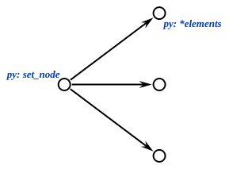
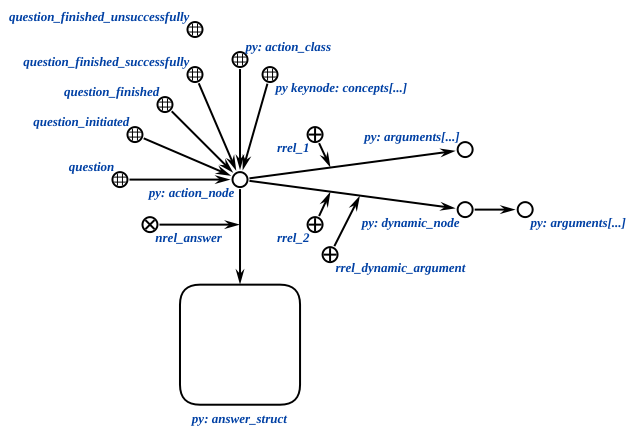
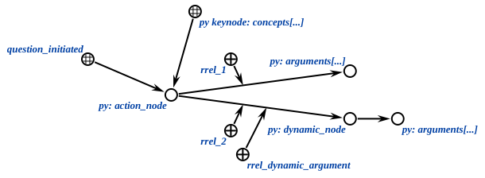

# py-sc-kpm

The python implementation of the knowledge processing machine (kpm)
for [sc-machine](https://github.com/ostis-ai/sc-machine).
Library provides tools for interacting with knowledge bases.
Communication with server is implemented in separate library
named [py-sc-client](https://github.com/ostis-ai/py-sc-client).
This module is compatible with 0.7.0 version
of [OSTIS Technology platform](https://github.com/ostis-ai/ostis-web-platform).

# API Reference

1. [Classes](#classes)
   + [ScKeynodes](#sckeynodes)
   + [ScAgent](#scagent-and-scagentclassic)
   + [ScModule](#scmodule)
   + [ScServer](#scserver)
2. [Utils](#utils)
   + [Common utils](#common-utils)
   + [Creating utils](#creating-utils)
   + [Retrieve utils](#retrieve-utils)
   + [Action utils](#action-utils)
3. [Use-cases](#use-cases)

## Classes

The library contains the python implementation of useful classes and functions to work with the sc-memory.

### ScKeynodes

Class which provides the ability to cache the identifier and ScAddr of keynodes stored in the KB.

```python
from sc_client.constants import sc_types
from sc_kpm import ScKeynodes

# Get the provided identifier
ScKeynodes["identifier_of_keynode"]  # Returns an ScAddr of the given identifier

# Get the unprovided identifier
ScKeynodes["not_stored_in_kb"]  # Raises InvalidValueError if an identifier doesn't exist in the KB
ScKeynodes.get("not_stored_in_kb")  # Returns an invalid ScAddr(0) in the same situation

# Resolve identifier
ScKeynodes.resolve("my_class_node", sc_types.NODE_CONST_CLASS)  # Returns the element if it exists, otherwise creates
ScKeynodes.resolve("some_node", None)  # Returns the element if it exists, otherwise returns an invalid ScAddr(0)

# Delete identifier
ScKeynodes.delete("identifier_to_delete")  # Delete keynode from kb and ScKeynodes cache
```

### ScAgent and ScAgentClassic

A classes for handling a single ScEvent. Define your agents like this:

```python
from sc_client.models import ScAddr
from sc_kpm import ScAgent, ScAgentClassic, ScResult


class ScAgentTest(ScAgent):
    def on_event(self, class_node: ScAddr, edge: ScAddr, action_node: ScAddr) -> ScResult:
        ...
        return ScResult.OK


class ScAgentClassicTest(ScAgentClassic):
    def on_event(self, class_node: ScAddr, edge: ScAddr, action_node: ScAddr) -> ScResult:
        # ScAgentClassic automatically checks its action
        ...
        return ScResult.OK
```

For the ScAgent initialization you should define the sc-element and the type of the ScEvent.

For the ScAgentClassic initialization
you should define the identifier of the action class node and arguments of the ScAgent.
`event_class` is set to the `question_initiated` keynode by default.
`event_type` is set to the `ScEventType.ADD_OUTGOING_EDGE` type by default.

**ClassicScAgent checks its action element automatically and doesn't run `on_event` method if checking fails.**

```python
from sc_client.constants import sc_types
from sc_client.constants.common import ScEventType
from sc_kpm import ScKeynodes

action_class = ScKeynodes.resolve("test_class", sc_types.NODE_CONST_CLASS)
agent = ScAgentTest(action_class, ScEventType.ADD_OUTGOING_EDGE)

classic_agent = ScAgentClassicTest("classic_test_class")
classic_agent_ingoing = ScAgentClassicTest("classic_test_class", ScEventType.ADD_INGOING_EDGE)
```

### ScModule

A class for handling multiple ScAgent objects.
Define your modules like this:

```python
from sc_kpm import ScModule

module = ScModule(
    agent1,
    agent2,
)
...
module.add_agent(agent3)
...
module.remove_agent(agent3)
```

_Note: you don't need remove agents in the end of program._

### ScServer

A class for serving, register ScModule objects.

Firstly you need connect to server. You can use connect/disconnect methods:

```python
from sc_kpm import ScServer

SC_SERVER_URL = "ws://localhost:8090/ws_json"
server = ScServer(SC_SERVER_URL)
server.connect()
...
server.disconnect()
```

Or with-statement. We recommend it because it easier to use, and it's safe:

```python
from sc_kpm import ScServer

SC_SERVER_URL = "ws://localhost:8090/ws_json"
server = ScServer(SC_SERVER_URL)
with server.connect():
    ...
```

After connection, you can add and remove your modules. Manage your modules like this:

```python
...
with server.connect():
    module = ScModule(...)
    server.add_modules(module)
    ...
    server.remove_modules(module)
```

But the modules are still not registered. For this use register_modules/unregister_modules methods:

```python
...
with server.connect():
    ...
    server.register_modules()
    ...
    server.unregister_modules()
```

Or one mode with-statement.
We also recommend to use so because it guarantees a safe agents unregistration if errors occur:

```python
...
with server.connect():
    ...
    with server.register_modules():
        ...
```

If you needn't separate connecting and registration, you can do it all using one command:

```python
with server.start():
    ...
# or
server.start()
...
server.stop()
```

There is also method for stopping program until a SIGINT signal (or ^C, or terminate in IDE) is received.
So you can leave agents registered for a long time:

```python
...
with server.connect():
    # Creating some agents
    with server.register_modules():
        # Registration some agents
        server.serve()  # Agents will be active until ^C
```

## Utils

There are some functions for working with nodes, edges, links: create them, search, get content, delete, etc.
There is also possibility to wrap in set or oriented set.

## Common utils

There are utils to work with basic elements

_You can import these utils from `sc_kpm.utils`_

### Nodes creating

If you want to create one or more nodes use these functions with type setting argument:

```python
def create_node(node_type: ScType, sys_idtf: str = None) -> ScAddr: ...


def create_nodes(*node_types: ScType) -> List[ScAddr]: ...
```

`sys_idtf` is optional name of keynode if you want to add it there.

```python
from sc_client.constants import sc_types
from sc_kpm import ScKeynodes
from sc_kpm.utils.common_utils import create_node, create_nodes

lang = create_node(sc_types.NODE_CONST_CLASS)  # ScAddr(...)
lang_en = create_node(sc_types.NODE_CONST_CLASS, "lang_en")  # ScAddr(...)
assert lang_en == ScKeynodes["lang_en"]
elements = create_nodes(sc_types.NODE_CONST, sc_types.NODE_VAR)  # [ScAddr(...), ScAddr(...)]
```

### Edges creating

For creating edge between **src** and **trg** with setting its type use **create_edge** function:

```python
def create_edge(edge_type: ScType, src: ScAddr, trg: ScAddr) -> ScAddr: ...
```

```python
from sc_client.constants import sc_types
from sc_kpm.utils import create_nodes
from sc_kpm.utils import create_edge

src, trg = create_nodes(*[sc_types.NODE_CONST] * 2)
msg_edge = create_edge(sc_types.EDGE_ACCESS_CONST_POS_PERM, src, trg)  # ScAddr(...)
assert src.is_valid() and trg.is_valid() and msg_edge.is_valid()
```

Function **is_valid()** is used for validation addresses of nodes or edges.

### Links creating

For creating links with string type content (by default) use these functions:

```python
def create_link(
        content: Union[str, int],
        content_type: ScLinkContentType = ScLinkContentType.STRING,
        link_type: ScType = sc_types.LINK_CONST
) -> ScAddr: ...


def create_links(
        *contents: Union[str, int],
        content_type: ScLinkContentType = ScLinkContentType.STRING,
        link_type: ScType = sc_types.LINK_CONST,
) -> List[ScAddr]: ...
```

You may use **ScLinkContentType.STRING** and **ScLinkContentType.INT** types for content of created links.

```python
from sc_client.constants import sc_types
from sc_client.models import ScLinkContentType
from sc_kpm.utils import create_link, create_links

msg = create_link("hello")  # ScAddr(...)
four = create_link(4, ScLinkContentType.INT)  # ScAddr(...)
water = create_link("water", link_type=sc_types.LINK_VAR)  # ScAddr(...)
names = create_links("Sam", "Pit")  # [ScAddr(...), ScAddr(...)]
```

### Relations creating

Create different binary relations with these functions:

```python
def create_binary_relation(edge_type: ScType, src: ScAddr, trg: ScAddr, *relations: ScAddr) -> ScAddr: ...


def create_role_relation(src: ScAddr, trg: ScAddr, *rrel_nodes: ScAddr) -> ScAddr: ...


def create_norole_relation(src: ScAddr, trg: ScAddr, *nrel_nodes: ScAddr) -> ScAddr: ...
```

```python
from sc_client.constants import sc_types
from sc_kpm import ScKeynodes
from sc_kpm.identifiers import CommonIdentifiers
from sc_kpm.utils import create_node, create_nodes
from sc_kpm.utils import create_binary_relation, create_role_relation, create_norole_relation

src, trg = create_nodes(*[sc_types.NODE_CONST] * 2)
increase_relation = create_node(sc_types.NODE_CONST_CLASS, "increase")

brel = create_binary_relation(sc_types.EDGE_ACCESS_CONST_POS_PERM, src, trg, increase_relation)  # ScAddr(...)
rrel = create_role_relation(src, trg, ScKeynodes[CommonIdentifiers.RREL_ONE])  # ScAddr(...)
nrel = create_norole_relation(src, trg, create_node(sc_types.NODE_CONST_NOROLE, "connection"))  # ScAddr(...)
```

### Deleting utils

If you want remove elements (nodes, edges) use function:

```python
def delete_elements(*addrs: ScAddr) -> bool: ...
```

If you want to remove all edges between two nodes, which define by their type use

```python
def delete_edges(source: ScAddr, target: ScAddr, *edge_types: ScType) -> bool: ...
```

These two functions return **True** if operations was successful and **False** otherwise.

```python
from sc_client.constants import sc_types
from sc_kpm.utils import create_nodes, create_edge
from sc_kpm.utils import delete_edges, delete_elements

elements = create_nodes(*[sc_types.NODE_CONST] * 2)
delete_elements(*elements)  # True

src, trg = create_nodes(*[sc_types.NODE_CONST] * 2)
edge = create_edge(sc_types.EDGE_ACCESS_CONST_POS_PERM, src, trg)
delete_edges(src, trg, sc_types.EDGE_ACCESS_CONST_POS_PERM)  # True
```

### Getting edges

For getting edge or edges between two nodes use:

```python
def get_edge(source: ScAddr, target: ScAddr, edge_type: ScType) -> ScAddr: ...


def get_edges(source: ScAddr, target: ScAddr, *edge_types: ScType) -> List[ScAddr]: ...
```

_**NOTE: Use VAR type instead of CONST in getting utils**_

```python
from sc_client.constants import sc_types
from sc_kpm.utils import create_nodes, create_edge
from sc_kpm.utils import get_edge, get_edges

src, trg = create_nodes(*[sc_types.NODE_CONST] * 2)
edge1 = create_edge(sc_types.EDGE_ACCESS_CONST_POS_PERM, src, trg)
edge2 = create_edge(sc_types.EDGE_D_COMMON_CONST, src, trg)

class_edge = get_edge(src, trg, sc_types.EDGE_ACCESS_VAR_POS_PERM)  # ScAddr(...)
assert class_edge == edge1
edges = get_edges(src, trg, sc_types.EDGE_ACCESS_VAR_POS_PERM, sc_types.EDGE_D_COMMON_VAR)  # [ScAddr(...), ScAddr(...)]
assert edges == [edge1, edge2]
```

### Getting elements by relation

Get target element by source element and relation:

```python
def get_element_by_role_relation(src: ScAddr, rrel_node: ScAddr) -> ScAddr: ...


def get_element_by_norole_relation(src: ScAddr, nrel_node: ScAddr) -> ScAddr: ...
```

```python
from sc_client.constants import sc_types
from sc_kpm import ScKeynodes
from sc_kpm.identifiers import CommonIdentifiers
from sc_kpm.utils import create_nodes, create_role_relation, create_norole_relation
from sc_kpm.utils import get_element_by_role_relation, get_element_by_norole_relation

src, trg_rrel, trg_nrel = create_nodes(*[sc_types.NODE_CONST] * 3)
rrel = create_role_relation(src, trg_rrel, ScKeynodes[CommonIdentifiers.RREL_ONE])  # ScAddr(...)
nrel = create_norole_relation(src, trg_nrel, ScKeynodes[CommonIdentifiers.NREL_SYSTEM_IDENTIFIER])  # ScAddr(...)

result_rrel = get_element_by_role_relation(src, ScKeynodes[CommonIdentifiers.RREL_ONE])  # ScAddr(...)
assert result_rrel == trg_rrel
result_nrel = get_element_by_norole_relation(src, ScKeynodes[CommonIdentifiers.NREL_SYSTEM_IDENTIFIER])  # ScAddr(...)
assert result_nrel == trg_nrel
```

### Getting link content

For existed links you may get their content by address with this function:

```python
def get_link_content(link: ScAddr) -> Union[str, int]: ...
```

```python
from sc_kpm.utils import create_link
from sc_kpm.utils import get_link_content

water = create_link("water")
content = get_link_content(water)  # "water"
```

### Getting system identifier

For getting system identifier of keynode use:

```python
def get_system_idtf(addr: ScAddr) -> str: ...
```

```python
from sc_client.constants import sc_types
from sc_kpm import ScKeynodes
from sc_kpm.utils import create_node
from sc_kpm.utils import get_system_idtf

lang_en = create_node(sc_types.NODE_CONST_CLASS, "lang_en")  # ScAddr(...)
idtf = get_system_idtf(lang_en)  # "lang_en"
assert ScKeynodes[idtf] == lang_en
```

## Creating utils

There are functions to work with sets: create, wrap, etc.

### Set and structure creating

For wrapping some elements to set use next functions:

```python
def wrap_in_set(set_node: ScAddr, *elements: ScAddr) -> None: ...
```

**set_node** connects other elements.

If you want to create new set without existed **set_node** use:

```python
def create_set(set_type: ScType, *elements: ScAddr) -> ScAddr: ...
```

For creating structure from existed nodes use next function:

```python
def create_structure(*elements: ScAddr) -> ScAddr: ...
```

This is a presentation of set in SCg-code:



Next two pictures show equivalent presentations of structures in SCg-code:


In structure sc_type of **main node** is `sc_types.NODE_CONST_STRUCT`

```python
from sc_client.constants import sc_types
from sc_kpm.utils import create_node, create_nodes
from sc_kpm.utils.creation_utils import wrap_in_set, create_set, create_structure

elements = create_nodes(sc_types.NODE_CONST, sc_types.NODE_VAR, sc_types.NODE_CONST)

set_node = create_node(sc_types.NODE_CONST_CLASS)
wrap_in_set(set_node, *elements)
# or
set_node = create_set(sc_types.NODE_CONST, *elements)  # ScAddr(...)
# or
struct_node = create_structure(*elements)  # ScAddr(...)
```

### Oriented set creating

For wrapping nodes to oriented set use next function:

```python
def wrap_in_oriented_set(set_node: ScAddr, start_element: ScAddr, *elements: ScAddr) -> None: ...
```

For creating oriented set without explicitly **set_node** use:

```python
def create_oriented_set(*elements: ScAddr) -> ScAddr: ...
```

On an oriented set, the order of nodes is given:


```python
from sc_client.constants import sc_types
from sc_kpm.utils import create_node, create_nodes
from sc_kpm.utils.creation_utils import wrap_in_oriented_set, create_oriented_set

elements = create_nodes(sc_types.NODE_CONST, sc_types.NODE_CONST, sc_types.NODE_CONST)

set_node = create_node(sc_types.NODE_CONST_CLASS)
wrap_in_oriented_set(set_node, *elements)
# or
set_node = create_oriented_set(*elements)  # ScAddr(...)
```

## Retrieve utils

There are utils for searching elements of sets and getting their power

### Getting sets elements

If you want to get elements of set or oriented set by **set node** use:

```python
def get_set_elements(set_node: ScAddr) -> List[ScAddr]: ...


def get_oriented_set_elements(set_node: ScAddr) -> List[ScAddr]: ...
```

```python
from sc_client.constants import sc_types
from sc_kpm.utils import create_nodes
from sc_kpm.utils.creation_utils import create_structure, create_oriented_set
from sc_kpm.utils.retrieve_utils import get_set_elements, get_oriented_set_elements

elements = create_nodes(sc_types.NODE_CONST, sc_types.NODE_VAR)
struct_node = create_structure(*elements)
search_results = get_set_elements(struct_node)  # [ScAddr(...), ScAddr(...)]
assert search_results == elements

elements = create_nodes(sc_types.NODE_CONST, sc_types.NODE_VAR)
set_node = create_oriented_set(*elements)
search_results = get_oriented_set_elements(set_node)  # [ScAddr(...), ScAddr(...)]
assert search_results == elements
```

### Getting set power

For getting count of elements in set or oriented set use:

```python
def get_set_power(set_node: ScAddr) -> int: ...
```

```python
from sc_client.constants import sc_types
from sc_kpm.utils import create_nodes
from sc_kpm.utils.creation_utils import create_structure
from sc_kpm.utils.retrieve_utils import get_set_power

elements = create_nodes(sc_types.NODE_CONST, sc_types.NODE_VAR)
struct_node = create_structure(*elements)

power = get_set_power(struct_node)  # 2
assert power == len(elements)
```

## Action utils

Utils to work with actions, events and agents



### Check action class

```python
def check_action_class(action_class: Union[ScAddr, Idtf], action_node: ScAddr) -> bool: ...
```

This function returns **True** if action class has connection to action node.
You can use identifier of action class instead of ScAddr.
This function should not be used in the ScAgentClassic.


```python
from sc_client.constants import sc_types
from sc_kpm import ScKeynodes
from sc_kpm.identifiers import CommonIdentifiers
from sc_kpm.utils import create_node, create_edge
from sc_kpm.utils.action_utils import check_action_class

action_node = create_node(sc_types.NODE_CONST)
create_edge(sc_types.EDGE_ACCESS_CONST_POS_PERM, ScKeynodes[CommonIdentifiers.QUESTION], action_node)
action_class = create_node(sc_types.NODE_CONST_CLASS, "some_classification")
create_edge(sc_types.EDGE_ACCESS_CONST_POS_PERM, action_class, action_node)

assert check_action_class(action_class, action_node)
# or
assert check_action_class("some_classification", action_node)
```

### Get action arguments

For getting list of action arguments concatenated by `rrel_[1 -> count]` use:

```python
def get_action_arguments(action_class: Union[ScAddr, Idtf], count: int) -> List[ScAddr]: ...
```


```python
from sc_client.constants import sc_types
from sc_kpm import ScKeynodes
from sc_kpm.identifiers import CommonIdentifiers
from sc_kpm.utils import create_node, create_edge, create_role_relation
from sc_kpm.utils.action_utils import get_action_arguments

action_node = create_node(sc_types.NODE_CONST)

# Static argument
argument1 = create_node(sc_types.NODE_CONST)
create_role_relation(action_node, argument1, ScKeynodes[CommonIdentifiers.RREL_ONE])

# Dynamic argument
dynamic_node = create_node(sc_types.NODE_CONST)
rrel_dynamic_arg = ScKeynodes[CommonIdentifiers.RREL_DYNAMIC_ARGUMENT]
create_role_relation(action_node, dynamic_node, rrel_dynamic_arg, ScKeynodes[CommonIdentifiers.RREL_TWO])
argument2 = create_node(sc_types.NODE_CONST)
create_edge(sc_types.EDGE_ACCESS_CONST_POS_TEMP, dynamic_node, argument2)

arguments = get_action_arguments(action_node, 2)
assert arguments == [argument1, dynamic_node]
```

### Create and get action answer

```python
def create_action_answer(action_node: ScAddr, *elements: ScAddr) -> None: ...


def get_action_answer(action_node: ScAddr) -> ScAddr: ...
```

Create and get structure with output of action


```python
from sc_client.constants import sc_types
from sc_kpm.utils import create_node
from sc_kpm.utils.action_utils import create_action_answer, get_action_answer
from sc_kpm.utils.retrieve_utils import get_set_elements

action_node = create_node(sc_types.NODE_CONST_STRUCT)
answer_element = create_node(sc_types.NODE_CONST_STRUCT)
create_action_answer(action_node, answer_element)
result = get_action_answer(action_node)
result_elements = get_set_elements(result)
assert result_elements == [answer_element]
```

### Call, execute and wait agent

Agent call function: creates **action node** with some arguments, concepts and connects it to the node with initiation identifier.
Returns **question node**

```python
def call_agent(
        arguments: Dict[ScAddr, IsDynamic],
        concepts: List[Idtf],
        initiation: Idtf = QuestionStatus.QUESTION_INITIATED,
) -> ScAddr: ...
```

Agent wait function: Waits for creation of edge to reaction node for some seconds.

```python
def wait_agent(seconds: float, question_node: ScAddr, reaction_node: ScAddr) -> None: ...
```

Agent execute function: combines two previous functions -- calls, waits and returns question node and **True** if success

```python
def execute_agent(
        arguments: Dict[ScAddr, IsDynamic],
        concepts: List[Idtf],
        initiation: Idtf = QuestionStatus.QUESTION_INITIATED,
        reaction: Idtf = QuestionStatus.QUESTION_FINISHED_SUCCESSFULLY,
        wait_time: int = COMMON_WAIT_TIME,  # 5
) -> Tuple[ScAddr, bool]: ...
```




```python
from sc_client.models import ScLinkContentType
from sc_kpm import ScKeynodes
from sc_kpm.identifiers import CommonIdentifiers, QuestionStatus
from sc_kpm.utils import create_link
from sc_kpm.utils.action_utils import execute_agent, call_agent, wait_agent

arg1 = create_link(2, ScLinkContentType.INT)
arg2 = create_link(3, ScLinkContentType.INT)

kwargs = dict(
    arguments={arg1: False, arg2: False},
    concepts=[CommonIdentifiers.QUESTION, "some_class_name"],
)

question = call_agent(**kwargs)  # ScAddr(...)
wait_agent(3, question, ScKeynodes[QuestionStatus.QUESTION_FINISHED])
# or
question, is_successfully = execute_agent(**kwargs, wait_time=3)  # ScAddr(...), bool
```

### Finish action

Function `finish_action` connects status class to action node:

```python
def finish_action(action_node: ScAddr, status: Idtf = QuestionStatus.QUESTION_FINISHED) -> ScAddr: ...
```

Function `finish_action_with_status` connects `question_finished` and `question_finished_(un)successfully` statuses to it:

```python
def finish_action_with_status(action_node: ScAddr, is_success: bool = True) -> None: ...
```


```python
from sc_client.constants import sc_types
from sc_kpm import ScKeynodes
from sc_kpm.identifiers import QuestionStatus
from sc_kpm.utils import create_node, check_edge
from sc_kpm.utils.action_utils import finish_action, finish_action_with_status

action_node = create_node(sc_types.NODE_CONST)

finish_action_with_status(action_node)
# or
finish_action_with_status(action_node, True)
# or
finish_action(action_node, QuestionStatus.QUESTION_FINISHED)
finish_action(action_node, QuestionStatus.QUESTION_FINISHED_SUCCESSFULLY)

question_finished = ScKeynodes[QuestionStatus.QUESTION_FINISHED]
question_finished_successfully = ScKeynodes[QuestionStatus.QUESTION_FINISHED_SUCCESSFULLY]
assert check_edge(sc_types.EDGE_ACCESS_VAR_POS_PERM, question_finished, action_node)
assert check_edge(sc_types.EDGE_ACCESS_VAR_POS_PERM, question_finished_successfully, action_node)
```

# Use-cases

- Script for creating and registration agent until user press ^C:
    - [based on ScAgentClassic](docs/examples/register_and_wait_for_user.py)
- Scripts for creating agent to calculate sum of two arguments and confirm result:
    - [based on ScAgent](docs/examples/sum_agent.py)
    - [based on ScAgentClassic](docs/examples/sum_agent_classic.py)
- Logging examples:
    - [pretty project logging](docs/examples/pretty_logging.py)
