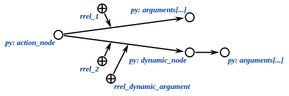

# py-sc-kpm

The python implementation of the knowledge processing machine (kpm)
for [sc-machine](https://github.com/ostis-ai/sc-machine).
Library provides tools for interacting with knowledge bases.
Communication with server is implemented in separate library
named [py-sc-client](https://github.com/ostis-ai/py-sc-client).
This module is compatible with 0.9.0 version
of [OSTIS Platform](https://github.com/ostis-ai/ostis-web-platform).

# API Reference

1. [Classes](#classes)
   + [ScKeynodes](#sckeynodes)
   + [ScAgent](#scagent-and-scagentclassic)
   + [ScModule](#scmodule)
   + [ScServer](#scserver)
2. [Utils](#utils)
   + [Common utils](#common-utils)
   + [Creating utils](#creating-utils)
   + [Retrieve utils](#retrieve-utils)
   + [Action utils](#action-utils)
3. [Use-cases](#use-cases)

## Classes

The library contains the python implementation of useful classes and functions to work with the sc-memory.

### ScKeynodes

Class which provides the ability to cache the identifier and ScAddr of keynodes stored in the KB.

```python
from sc_client.constants import sc_types
from sc_kpm import ScKeynodes

# Get the provided identifier
ScKeynodes["identifier_of_keynode"]  # Returns an ScAddr of the given identifier

# Get the unprovided identifier
ScKeynodes["not_stored_in_kb"]  # Raises InvalidValueError if an identifier doesn't exist in the KB
ScKeynodes.get("not_stored_in_kb")  # Returns an invalid ScAddr(0) in the same situation

# Resolve identifier
ScKeynodes.resolve("my_class_node", sc_types.NODE_CONST_CLASS)  # Returns the element if it exists, otherwise creates
ScKeynodes.resolve("some_node", None)  # Returns the element if it exists, otherwise returns an invalid ScAddr(0)

# Delete identifier
ScKeynodes.delete("identifier_to_delete")  # Delete keynode from kb and ScKeynodes cache

# Get rrel node
ScKeynodes.rrel_index(1)  # Returns valid ScAddr of 'rrel_1'
ScKeynodes.rrel_index(11)  # Raises KeyError if index more than 10
ScKeynodes.rrel_index("some_str")  # Raises TypeError if index is not int
```

### ScAgent and ScAgentClassic

A classes for handling a single ScEvent. Define your agents like this:

```python
from sc_client.models import ScAddr
from sc_kpm import ScAgent, ScAgentClassic, ScResult


class ScAgentTest(ScAgent):
    def on_event(self, class_node: ScAddr, edge: ScAddr, action_node: ScAddr) -> ScResult:
        ...
        return ScResult.OK


class ScAgentClassicTest(ScAgentClassic):
    def on_event(self, class_node: ScAddr, edge: ScAddr, action_node: ScAddr) -> ScResult:
        # ScAgentClassic automatically checks its action
        ...
        return ScResult.OK
```

For the ScAgent initialization you should define the sc-element and the type of the ScEvent.

For the ScAgentClassic initialization
you should define the identifier of the action class node and arguments of the ScAgent.
`event_class` is set to the `action_initiated` keynode by default.
`event_type` is set to the `ScEventType.ADD_OUTGOING_EDGE` type by default.

**ClassicScAgent checks its action element automatically and doesn't run `on_event` method if checking fails.**

```python
from sc_client.constants import sc_types
from sc_client.constants.common import ScEventType
from sc_kpm import ScKeynodes

action_class = ScKeynodes.resolve("test_class", sc_types.NODE_CONST_CLASS)
agent = ScAgentTest(action_class, ScEventType.ADD_OUTGOING_EDGE)

classic_agent = ScAgentClassicTest("classic_test_class")
classic_agent_ingoing = ScAgentClassicTest("classic_test_class", ScEventType.ADD_INGOING_EDGE)
```

### ScModule

A class for handling multiple ScAgent objects.
Define your modules like this:

```python
from sc_kpm import ScModule

module = ScModule(
    agent1,
    agent2,
)
...
module.add_agent(agent3)
...
module.remove_agent(agent3)
```

_Note: you don't need remove agents in the end of program._

### ScServer

A class for serving, register ScModule objects.

Firstly you need connect to server. You can use connect/disconnect methods:

```python
from sc_kpm import ScServer

SC_SERVER_URL = "ws://localhost:8090/ws_json"
server = ScServer(SC_SERVER_URL)
server.connect()
...
server.disconnect()
```

Or with-statement. We recommend it because it easier to use, and it's safe:

```python
from sc_kpm import ScServer

SC_SERVER_URL = "ws://localhost:8090/ws_json"
server = ScServer(SC_SERVER_URL)
with server.connect():
    ...
```

After connection, you can add and remove your modules. Manage your modules like this:

```python
...
with server.connect():
    module = ScModule(...)
    server.add_modules(module)
    ...
    server.remove_modules(module)
```

But the modules are still not registered. For this use register_modules/unregister_modules methods:

```python
...
with server.connect():
    ...
    server.register_modules()
    ...
    server.unregister_modules()
```

Or one mode with-statement.
We also recommend to use so because it guarantees a safe agents unregistration if errors occur:

```python
...
with server.connect():
    ...
    with server.register_modules():
        ...
```

If you needn't separate connecting and registration, you can do it all using one command:

```python
with server.start():
    ...
# or
server.start()
...
server.stop()
```

There is also method for stopping program until a SIGINT signal (or ^C, or terminate in IDE) is received.
So you can leave agents registered for a long time:

```python
...
with server.connect():
    # Creating some agents
    with server.register_modules():
        # Registration some agents
        server.serve()  # Agents will be active until ^C
```

### ScSets

Sc-set is a construction that presents main node called `set_node` and linked elements.
There is no limit in types for sc-set elements:


#### ScSet

- *sc_kpm.sc_sets*.**ScSet**

Class for handling simple sc-sets.
It is the parent class for `ScOrientedSet` and `ScNumberedSet`

Methods and properties:

1. *ScSet*(*elements: ScAddr, set_node: ScAddr = None, set_node_type: ScType = None) -> None

   Constructor of sc-set receives all elements to add, optional `set_node` and optional `set_node_type`.
   If you don't specify `set_node`, it will be created with `set_node_type` (default NODE_CONST).

2. *ScSet*.**add**(*elements: ScAddr) -> None

   Add elements to the end of sc-set construction.

3. *ScSet*.**set_node** -> ScAddr

   Property to give the **main node** of sc-set.

4. *ScSet* == *ScSet* -> bool

   Check sc-sets have the same set_nodes.

5. *ScSet*.**elements_set** -> Set[ScAddr]

   Property to give all elements from sc-set as a set.
   Use it if you don't need order in ordered sets.

6. **iter**(*ScSet*) -> Iterator[ScAddr]

   Dunder method for iterating by sc-set.
   Lazy algorithm (ScOrientedSet and ScNumberedSet).

7. **len**(*ScSet*) -> int

   Fast dunder method to give **count of elements** (power of sc-set).

8. **bool**(*ScSet*) -> bool

   Dunder method for if-statement: True if there are elements in sc-set.

9. *ScSet*.**is_empty**() -> bool

   True if there are **no elements** in sc-set.

10. *ScAddr* **in** *ScSet* -> bool

    Dunder method: True if sc-set contains element.

11. *ScSet*.**clear**() -> bool

    Remove all elements from sc-set.

12. *ScSet*.**remove**(*elements: ScAddr) -> None

    Remove elements from sc-set.
    *WARNING*: method isn't optimized in ScOrientedSet and ScNumberedSet

```python
from sc_client.constants import sc_types
from sc_client.models import ScAddr

from sc_kpm.sc_sets import ScSet
from sc_kpm.utils import create_node, create_nodes

# Example elements to add
example_set_node: ScAddr = create_node(sc_types.NODE_CONST)
elements: list[ScAddr] = create_nodes(*[sc_types.NODE_CONST] * 5)

# Init sc-set and add elements
empty_set = ScSet()

set_with_elements = ScSet(elements[0], elements[1])
set_with_elements.add(elements[2], elements[3])
set_with_elements.add(elements[4])

set_with_elements_and_set_node = ScSet(elements[2], set_node=example_set_node)
empty_set_with_specific_set_node_type = ScSet(set_node_type=sc_types.NODE_VAR)

# Get set node
set_node = empty_set.set_node
assert set_with_elements_and_set_node.set_node == example_set_node

# Get elements: list and set
assert set_with_elements.elements_set == set(elements)  # set view faster and safe

# Iterate by elements
for element in set_with_elements:
    print(element)

# Length, bool, is_empty, in
assert len(set_with_elements) == len(elements)
assert bool(set_with_elements)
assert not set_with_elements.is_empty()
assert empty_set.is_empty()
assert elements[2] in set_with_elements

# Clear and remove
set_with_elements.remove(elements[4])
assert len(set_with_elements), len(elements) - 1
set_with_elements.clear()
assert set_with_elements.is_empty()
```

##### ScStructure

If `set_node` has type `sc_types.NODE_CONST_STRUCT` construction is called sc-structure
and looks like a loop in SCg:


- *sc_kpm*.**ScStructure**

Class for handling structure construction in the kb.
The same logic as in `ScSet`, but *set_node_type* if set NODE_CONST_STRUCT.
There are checks that set node has struct sc-type:

```python
from sc_kpm.sc_sets import ScStructure

sc_struct = ScStructure(..., set_node=..., set_node_type=...)

sc_struct = ScStructure(..., set_node=create_node(sc_types.NODE_CONST))  # InvalidTypeError - not struct type
sc_struct = ScStructure(..., set_node_type=sc_types.NODE_CONST)  # InvalidTypeError - not struct type
```

#### Ordered sc-sets

ScOrientedSet and ScNumberedSet are ordered sc-constructions.
Child classes of ScSet, have the order in iteration and get list elements:

- *Sc{ordered}Set*.**elements_set** -> List[ScAddr]

  Get the list of all elements with order

##### ScOrientedSet

- *sc_kpm*.**ScOrientedSet**


Class for handling sc-oriented-set construction.
Has marked edges between edges from set_node to elements.
Easy lazy iterating.
No access by index.

```python
from sc_client.constants import sc_types

from sc_kpm.sc_sets import ScOrientedSet
from sc_kpm.utils import create_nodes


elements = create_nodes(*[sc_types.NODE_CONST] * 5)
numbered_set = ScOrientedSet(*elements)
assert numbered_set.elements_list == elements
```

##### ScNumberedSet

- *sc_kpm*.**ScNumberedSet**


Class for handling sc-numbered-set construction.
Set-node is edged with numerating each element with rrel node.
Easy access to elements by index (index i is marked with rrel(i + 1))

```python
from sc_client.constants import sc_types

from sc_kpm.sc_sets import ScNumberedSet
from sc_kpm.utils import create_nodes


elements = create_nodes(*[sc_types.NODE_CONST] * 5)
numbered_set = ScNumberedSet(*elements)
assert numbered_set.elements_list == elements
assert numbered_set[2] == elements[2]
numbered_set[5]  # raise KeyError
```

## Utils

There are some functions for working with nodes, edges, links: create them, search, get content, delete, etc.
There is also possibility to wrap in set or oriented set.

## Common utils

There are utils to work with basic elements

_You can import these utils from `sc_kpm.utils`_

### Nodes creating

If you want to create one or more nodes use these functions with type setting argument:

```python
def create_node(node_type: ScType, sys_idtf: str = None) -> ScAddr: ...


def create_nodes(*node_types: ScType) -> List[ScAddr]: ...
```

`sys_idtf` is optional name of keynode if you want to add it there.

```python
from sc_client.constants import sc_types
from sc_kpm import ScKeynodes
from sc_kpm.utils.common_utils import create_node, create_nodes

lang = create_node(sc_types.NODE_CONST_CLASS)  # ScAddr(...)
lang_en = create_node(sc_types.NODE_CONST_CLASS)  # ScAddr(...)
assert lang.is_valid() and lang_en.is_valid()
elements = create_nodes(sc_types.NODE_CONST, sc_types.NODE_VAR)  # [ScAddr(...), ScAddr(...)]
assert len(elements) == 2
assert all(element.is_valid() for element in elements)
```

### Edges creating

For creating edge between **src** and **trg** with setting its type use **create_edge** function:

```python
def create_edge(edge_type: ScType, src: ScAddr, trg: ScAddr) -> ScAddr: ...

def create_edges(edge_type: ScType, src: ScAddr, *targets: ScAddr) -> List[ScAddr]: ...
```

```python
from sc_client.constants import sc_types
from sc_kpm.utils import create_nodes
from sc_kpm.utils import create_edge, create_edges

src, trg, trg2, trg3 = create_nodes(*[sc_types.NODE_CONST] * 4)
edge = create_edge(sc_types.EDGE_ACCESS_CONST_POS_PERM, src, trg)  # ScAddr(...)
edges = create_edges(sc_types.EDGE_ACCESS_CONST_POS_PERM, src, trg2, trg3)  # [ScAddr(...), ScAddr(...)]
assert edge.is_valid()
assert all(edges)
```

Function **is_valid()** is used for validation addresses of nodes or edges.

### Links creating

For creating links with string type content (by default) use these functions:

```python
def create_link(
        content: Union[str, int],
        content_type: ScLinkContentType = ScLinkContentType.STRING,
        link_type: ScType = sc_types.LINK_CONST
) -> ScAddr: ...


def create_links(
        *contents: Union[str, int],
        content_type: ScLinkContentType = ScLinkContentType.STRING,
        link_type: ScType = sc_types.LINK_CONST,
) -> List[ScAddr]: ...
```

You may use **ScLinkContentType.STRING** and **ScLinkContentType.INT** types for content of created links.

```python
from sc_client.constants import sc_types
from sc_client.models import ScLinkContentType
from sc_kpm.utils import create_link, create_links

msg = create_link("hello")  # ScAddr(...)
four = create_link(4, ScLinkContentType.INT)  # ScAddr(...)
water = create_link("water", link_type=sc_types.LINK_VAR)  # ScAddr(...)
names = create_links("Sam", "Pit")  # [ScAddr(...), ScAddr(...)]
```

### Relations creating

Create different binary relations with these functions:

```python
def create_binary_relation(edge_type: ScType, src: ScAddr, trg: ScAddr, *relations: ScAddr) -> ScAddr: ...


def create_role_relation(src: ScAddr, trg: ScAddr, *rrel_nodes: ScAddr) -> ScAddr: ...


def create_norole_relation(src: ScAddr, trg: ScAddr, *nrel_nodes: ScAddr) -> ScAddr: ...
```

```python
from sc_client.constants import sc_types
from sc_kpm import ScKeynodes
from sc_kpm.utils import create_node, create_nodes
from sc_kpm.utils import create_binary_relation, create_role_relation, create_norole_relation

src, trg = create_nodes(*[sc_types.NODE_CONST] * 2)
increase_relation = create_node(sc_types.NODE_CONST_CLASS)

brel = create_binary_relation(sc_types.EDGE_ACCESS_CONST_POS_PERM, src, trg, increase_relation)  # ScAddr(...)
rrel = create_role_relation(src, trg, ScKeynodes.rrel_index(1))  # ScAddr(...)
nrel = create_norole_relation(src, trg, create_node(sc_types.NODE_CONST_NOROLE))  # ScAddr(...)
```

### Deleting utils

If you want to remove all edges between two nodes, which define by their type use

```python
def delete_edges(source: ScAddr, target: ScAddr, *edge_types: ScType) -> bool: ...
```

It return **True** if operations was successful and **False** otherwise.

```python
from sc_client.constants import sc_types
from sc_kpm.utils import create_nodes, create_edge
from sc_kpm.utils import delete_edges

src, trg = create_nodes(*[sc_types.NODE_CONST] * 2)
edge = create_edge(sc_types.EDGE_ACCESS_CONST_POS_PERM, src, trg)
delete_edges(src, trg, sc_types.EDGE_ACCESS_CONST_POS_PERM)  # True
```

### Getting edges

For getting edge or edges between two nodes use:

```python
def get_edge(source: ScAddr, target: ScAddr, edge_type: ScType) -> ScAddr: ...


def get_edges(source: ScAddr, target: ScAddr, *edge_types: ScType) -> List[ScAddr]: ...
```

_**NOTE: Use VAR type instead of CONST in getting utils**_

```python
from sc_client.constants import sc_types
from sc_kpm.utils import create_nodes, create_edge
from sc_kpm.utils import get_edge, get_edges

src, trg = create_nodes(*[sc_types.NODE_CONST] * 2)
edge1 = create_edge(sc_types.EDGE_ACCESS_CONST_POS_PERM, src, trg)
edge2 = create_edge(sc_types.EDGE_D_COMMON_CONST, src, trg)

class_edge = get_edge(src, trg, sc_types.EDGE_ACCESS_VAR_POS_PERM)  # ScAddr(...)
assert class_edge == edge1
edges = get_edges(src, trg, sc_types.EDGE_ACCESS_VAR_POS_PERM, sc_types.EDGE_D_COMMON_VAR)  # [ScAddr(...), ScAddr(...)]
assert edges == [edge1, edge2]
```

### Getting elements by relation

Get target element by source element and relation:

```python
def get_element_by_role_relation(src: ScAddr, rrel_node: ScAddr) -> ScAddr: ...


def get_element_by_norole_relation(src: ScAddr, nrel_node: ScAddr) -> ScAddr: ...
```

```python
from sc_client.constants import sc_types
from sc_kpm import ScKeynodes
from sc_kpm.identifiers import CommonIdentifiers
from sc_kpm.utils import create_nodes, create_role_relation, create_norole_relation
from sc_kpm.utils import get_element_by_role_relation, get_element_by_norole_relation

src, trg_rrel, trg_nrel = create_nodes(*[sc_types.NODE_CONST] * 3)
rrel = create_role_relation(src, trg_rrel, ScKeynodes.rrel_index(1))  # ScAddr(...)
nrel = create_norole_relation(src, trg_nrel, ScKeynodes[CommonIdentifiers.NREL_SYSTEM_IDENTIFIER])  # ScAddr(...)

result_rrel = get_element_by_role_relation(src, ScKeynodes.rrel_index(1))  # ScAddr(...)
assert result_rrel == trg_rrel
result_nrel = get_element_by_norole_relation(src, ScKeynodes[CommonIdentifiers.NREL_SYSTEM_IDENTIFIER])  # ScAddr(...)
assert result_nrel == trg_nrel
```

### Getting link content

For existed links you may get their content by address with this function:

```python
def get_link_content(link: ScAddr) -> Union[str, int]: ...
```

```python
from sc_kpm.utils import create_link
from sc_kpm.utils import get_link_content_data

water = create_link("water")
content = get_link_content_data(water)  # "water"
```

### Getting system identifier

For getting system identifier of keynode use:

```python
def get_system_idtf(addr: ScAddr) -> str: ...
```

```python
from sc_client.constants import sc_types
from sc_kpm import ScKeynodes
from sc_kpm.utils import create_node
from sc_kpm.utils import get_system_idtf

lang_en = create_node(sc_types.NODE_CONST_CLASS)  # ScAddr(...)
idtf = get_system_idtf(lang_en)  # "lang_en"
assert ScKeynodes[idtf] == lang_en
```

## Action utils

Utils to work with actions, events and agents


### Check action class

```python
def check_action_class(action_class: Union[ScAddr, Idtf], action_node: ScAddr) -> bool: ...
```

This function returns **True** if action class has connection to action node.
You can use identifier of action class instead of ScAddr.
This function should not be used in the ScAgentClassic.


```python
from sc_client.constants import sc_types
from sc_kpm import ScKeynodes
from sc_kpm.identifiers import CommonIdentifiers
from sc_kpm.utils import create_node, create_edge
from sc_kpm.utils.action_utils import check_action_class

action_node = create_node(sc_types.NODE_CONST)
create_edge(sc_types.EDGE_ACCESS_CONST_POS_PERM, ScKeynodes[CommonIdentifiers.ACTION], action_node)
action_class = create_node(sc_types.NODE_CONST_CLASS)
create_edge(sc_types.EDGE_ACCESS_CONST_POS_PERM, action_class, action_node)

assert check_action_class(action_class, action_node)
# or
assert check_action_class("some_classification", action_node)
```

### Get action arguments

For getting list of action arguments concatenated by `rrel_[1 -> count]` use:

```python
def get_action_arguments(action_class: Union[ScAddr, Idtf], count: int) -> List[ScAddr]: ...
```



```python
from sc_client.constants import sc_types
from sc_kpm import ScKeynodes
from sc_kpm.identifiers import CommonIdentifiers
from sc_kpm.utils import create_node, create_edge, create_role_relation
from sc_kpm.utils.action_utils import get_action_arguments

action_node = create_node(sc_types.NODE_CONST)

# Static argument
argument1 = create_node(sc_types.NODE_CONST)
create_role_relation(action_node, argument1, ScKeynodes.rrel_index(1))

# Dynamic argument
dynamic_node = create_node(sc_types.NODE_CONST)
rrel_dynamic_arg = ScKeynodes[CommonIdentifiers.RREL_DYNAMIC_ARGUMENT]
create_role_relation(action_node, dynamic_node, rrel_dynamic_arg, ScKeynodes.rrel_index(2))
argument2 = create_node(sc_types.NODE_CONST)
create_edge(sc_types.EDGE_ACCESS_CONST_POS_TEMP, dynamic_node, argument2)

arguments = get_action_arguments(action_node, 2)
assert arguments == [argument1, dynamic_node]
```

### Create and get action answer

```python
def create_action_answer(action_node: ScAddr, *elements: ScAddr) -> None: ...


def get_action_answer(action_node: ScAddr) -> ScAddr: ...
```

Create and get structure with output of action


```python
from sc_client.constants import sc_types
from sc_kpm.utils import create_node
from sc_kpm.utils.action_utils import create_action_answer, get_action_answer
from sc_kpm.sc_sets import ScStructure

action_node = create_node(sc_types.NODE_CONST_STRUCT)
answer_element = create_node(sc_types.NODE_CONST_STRUCT)
create_action_answer(action_node, answer_element)
result = get_action_answer(action_node)
result_elements = ScStructure(result).elements_set
assert result_elements == {answer_element}
```

### Call, execute and wait agent

Agent call function: creates **action node** with some arguments, concepts and connects it to the node with initiation identifier.
Returns **action node**

```python
def call_agent(
        arguments: Dict[ScAddr, IsDynamic],
        concepts: List[Idtf],
        initiation: Idtf = ActionStatus.ACTION_INITIATED,
) -> ScAddr: ...
```

Agent wait function: Waits for creation of edge to reaction node for some seconds.
Default reaction_node is `action_finished`.

```python
def wait_agent(seconds: float, action_node: ScAddr, reaction_node: ScAddr = None) -> None: ...
```

Agent execute function: combines two previous functions -- calls, waits and returns action node and **True** if success

```python
def execute_agent(
        arguments: Dict[ScAddr, IsDynamic],
        concepts: List[Idtf],
        initiation: Idtf = ActionStatus.ACTION_INITIATED,
        reaction: Idtf = ActionStatus.ACTION_FINISHED_SUCCESSFULLY,
        wait_time: int = COMMON_WAIT_TIME,  # 5
) -> Tuple[ScAddr, bool]: ...
```


```python
from sc_client.models import ScLinkContentType
from sc_kpm import ScKeynodes
from sc_kpm.identifiers import CommonIdentifiers, ActionStatus
from sc_kpm.utils import create_link
from sc_kpm.utils.action_utils import execute_agent, call_agent, wait_agent

arg1 = create_link(2, ScLinkContentType.INT)
arg2 = create_link(3, ScLinkContentType.INT)

kwargs = dict(
    arguments={arg1: False, arg2: False},
    concepts=[CommonIdentifiers.ACTION, "some_class_name"],
)

action = call_agent(**kwargs)  # ScAddr(...)
wait_agent(3, action, ScKeynodes[ActionStatus.ACTION_FINISHED])
# or
action, is_successfully = execute_agent(**kwargs, wait_time=3)  # ScAddr(...), bool
```

### Create, call and execute action

Functions that allow to create action and add arguments and call later.

Function that creates action with concepts and return its ScAddr.

```python
def create_action(*concepts: Idtf) -> ScAddr: ...
```

Function that creates arguments of action

```python
def add_action_arguments(action_node: ScAddr, arguments: Dict[ScAddr, IsDynamic]) -> None: ...
```

Now you can call or execute action.
Action call functions don't return action_node because it's parameter to them.

```python
def call_action(
        action_node: ScAddr, initiation: Idtf = ActionStatus.ACTION_INITIATED
) -> None: ...
```

```python
def execute_action(
        action_node: ScAddr,
        initiation: Idtf = ActionStatus.ACTION_INITIATED,
        reaction: Idtf = ActionStatus.ACTION_FINISHED_SUCCESSFULLY,
        wait_time: float = COMMON_WAIT_TIME,
) -> bool: ...
```

Example:

```python
from sc_client.models import ScLinkContentType
from sc_kpm import ScKeynodes
from sc_kpm.identifiers import CommonIdentifiers, ActionStatus
from sc_kpm.utils import create_link
from sc_kpm.utils.action_utils import add_action_arguments, call_action, create_action, execute_action, wait_agent

arg1 = create_link(2, ScLinkContentType.INT)
arg2 = create_link(3, ScLinkContentType.INT)

action_node = create_action(CommonIdentifiers.ACTION, "some_class_name")  # ScAddr(...)
# Do something here
arguments = {arg1: False, arg2: False}

add_action_arguments(action_node, arguments)
call_action(action_node)
wait_agent(3, action_node, ScKeynodes[ActionStatus.ACTION_FINISHED])
# or
is_successful = execute_action(action_node, wait_time=3)  # bool
```

### Finish action

Function `finish_action` connects status class to action node:

```python
def finish_action(action_node: ScAddr, status: Idtf = ActionStatus.ACTION_FINISHED) -> ScAddr: ...
```

Function `finish_action_with_status` connects `action_finished` and `action_finished_(un)successfully` statuses to it:

```python
def finish_action_with_status(action_node: ScAddr, is_success: bool = True) -> None: ...
```


```python
from sc_client.constants import sc_types
from sc_kpm import ScKeynodes
from sc_kpm.identifiers import ActionStatus
from sc_kpm.utils import create_node, check_edge
from sc_kpm.utils.action_utils import finish_action, finish_action_with_status

action_node = create_node(sc_types.NODE_CONST)

finish_action_with_status(action_node)
# or
finish_action_with_status(action_node, True)
# or
finish_action(action_node, ActionStatus.ACTION_FINISHED)
finish_action(action_node, ActionStatus.ACTION_FINISHED_SUCCESSFULLY)

action_finished = ScKeynodes[ActionStatus.ACTION_FINISHED]
action_finished_successfully = ScKeynodes[ActionStatus.ACTION_FINISHED_SUCCESSFULLY]
assert check_edge(sc_types.EDGE_ACCESS_VAR_POS_PERM, action_finished, action_node)
assert check_edge(sc_types.EDGE_ACCESS_VAR_POS_PERM, action_finished_successfully, action_node)
```

# Use-cases

- Script for creating and registration agent until user press ^C:
    - [based on ScAgentClassic](docs/examples/register_and_wait_for_user.py)
- Scripts for creating agent to calculate sum of two arguments and confirm result:
    - [based on ScAgent](docs/examples/sum_agent.py)
    - [based on ScAgentClassic](docs/examples/sum_agent_classic.py)
- Logging examples:
    - [pretty project logging](docs/examples/pretty_logging.py)
